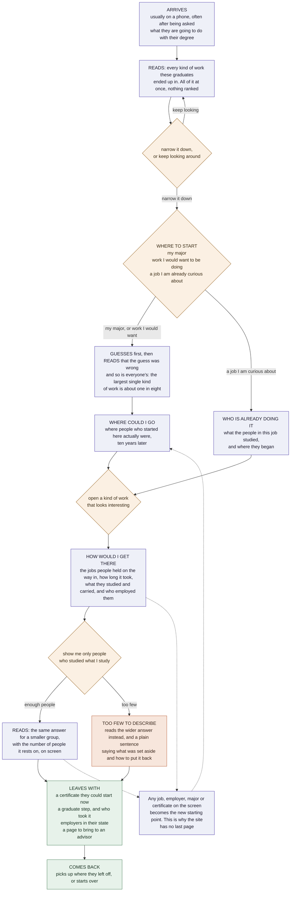

# The user journey, in plain terms

**10 September 2026.** A walk-through of the site for a reader who is not going to build it.
It shows the path a student takes, what they read at each stop, what they decide, what data
sits underneath, and what NHA has to write.

The detailed version, with the state model and the interface rules, is
`2026-09-10-user-journey.md`. This one is for talking about the product rather than
constructing it.

**The chart below is generated from `2026-09-10-user-journey-narrative.md`, which says the
same journey in sentences.** Edit the prose there rather than the chart here, and this file
is rebuilt to match.

---

## The shape of it

A student arrives asking one question and leaves with something to do. Between those two
points they are really asking three questions, and the site is built so that all three are
the same screen with different things filled in.

- **Where could I go?** Start from a major or an interest, and see where people went.
- **How would I get there?** Fix both ends, and see the route between them.
- **Who is already doing it?** Start from a job, and see who ended up in it.

Nobody has to know which question they are asking. It follows from what they have picked.
The reader can switch between them at any point without going back to the beginning, and
that is the single thing that makes the site feel like exploring rather than reading a
report.

---

## The path

Blue is something to read. Amber is a decision. Orange is the moment the data runs thin.
Green is leaving with something. The dotted lines are the loop that keeps the site from
having an end: anything named on the screen can become the next question.

---

## What sits under each step

Every row says what the reader gets, what they decide, which part of the corpus answers it,
and what NHA has to write for it. The last column is the work that no amount of data does
for us.

| Step | What they read or do | What they decide | The data behind it | What NHA writes |
|---|---|---|---|---|
| **Arrives** | One sentence, and a statement of who is actually in this sample | Whether to stay | The population itself: 2.0M profiles, 486,000 with a humanities degree, 407,000 followable across fifteen years | The opening claim, and the population statement in the same view. Not a mission statement |
| **The whole field** | Every kind of work these graduates ended up in, shown at once and not ranked | Narrow, or keep looking | Pooled year-ten destinations. Computed and in the portal today | The caption that makes an unranked picture feel like an answer rather than a shrug |
| **Where to start** | Three ways in: a major, a description of work they would want, or a job title | Which one, and they can use more than one | Fields of study; eleven first-person descriptions of kinds of work; 13,933 job titles held by ten or more people | The eleven descriptions, in a student's voice rather than ours. This is a writing job, not a data job |
| **The guess** | A question asked before any number appears | One tap, and skipping is fine | Nothing. This is an interface device | The prompt, and the reply for being wrong, written to be encouraging rather than clever |
| **Wrong, and so is everyone** | The largest single kind of work is about one in eight | Whether to believe it | Destination shares at year ten | The gloss. This is where the site's whole argument lives in two sentences |
| **Where could I go** | Where people who started here actually were, ten years later | Which destination to open | Origin-to-destination cells, all of which clear the reporting bar | The caption, in past tense, about people rather than paths |
| **Who is already doing it** | What people in this job studied, and where they started | Which starting point to follow back | The same cells read backwards, plus education records | One line explaining that the arrow can be read in both directions |
| **How would I get there** | First jobs, elapsed years, what they studied, what they carried, where they worked | Whether this is a route they could take | Career steps at job-title grain; 4.3M title-to-title moves; 1.67M certification records across 545,000 people; employer and location on the steps themselves | Five panel introductions. The order matters more than the wording: what the work is, then how people got in |
| **People like me** | The same answer for a smaller group, with the count visible | Whether to narrow further | Field of study crossed with start and destination. 98.5% of readers land in a group large enough to describe | The rule, in one line: the number on screen is the number this is based on |
| **Not enough people** | An honest sentence, and the wider answer already showing | Which condition to give up | Cells below ten people, which are counted but never named | Three sentences, one per rung of widening. These need writing before the screen is built, not after |
| **The far edge** | Thousands of specific, odd, real jobs nobody has shown a student | Whether to follow one | 638,368 distinct job titles across 355,437 people. 86.4% were held by exactly one person | The line that makes a rare job read as real rather than as a warning. Never the word "only" |
| **Leaves with** | A certificate, a graduate step, employers in their state, and a page for an advisor | What to actually do this month | Certifications; graduate enrolments; employer and state, recorded for about half the sample | What each of those choices meant for the people who made it, with the caveat given room rather than hidden |
| **Comes back** | Where they were last time | Resume, or start over | Held on the device. Nothing is stored about the reader | One sentence that reads as recognition rather than tracking |

---

## The four things the site never does

Worth saying out loud, because each one is a thing people will ask for.

**It never says what anyone was paid.** The corpus has no earnings, so the site has none.
When a reader asks, the site says so plainly, hands over the federal occupation code and
points at the Bureau of Labor Statistics, and goes back to what it was showing.

**It never ranks.** No best majors, no top careers, no match score, no result telling
somebody what they are. A demand for a verdict gets the wide picture back.

**It never describes fewer than ten people.** Small groups are counted and never named,
because at that size we would be describing individuals. When a reader's question lands on
one, the site widens the question, shows the wider answer, and says which condition it set
aside.

**It never pretends to be everybody.** This is people who keep a public professional
profile, which undercounts the ones who left the professional track. That runs in the
direction of the story we want to tell, which is exactly why it goes on the page rather
than in a footnote.

---

## What this asks of NHA

Reading down the last column: the site needs roughly two dozen short pieces of writing, and
about six of them are load-bearing.

1. The opening claim and the population statement, together.
2. The eleven descriptions of kinds of work, in a student's voice.
3. The gloss on the guess, which carries the argument.
4. The three widening sentences for when the data runs thin.
5. The line that makes a rare job read as real.
6. What each parting choice meant for the people who made it.

None of these are captions. They are the places where the site either sounds like a person
who respects the reader or sounds like a dashboard, and no dataset decides which.
