# The user journey

**10 September 2026.** The consolidated flowchart for the undergraduate-facing site. It
supersedes the five-band discovery flow in `2026-09-01-lucidchart-prompt.md` and draws Map 1
and Map 2 of `2026-09-01-product-maps.md` as one connected journey rather than a state grid
and a storyboard that never meet.

Four independent design passes fed this: an interaction architect, an onboarding designer, an
advocacy communications strategist, and a service designer. Each produced a full journey from
its own lens. Section 9 records who contributed what, and what was rejected.

---

## 1. How to edit this file

The chart and the words are deliberately separate, so that two different people can work on
them without touching each other's material.

- **The chart** is Mermaid, in the fenced block in section 5. Node labels are short. Edit it
  in any text editor; it renders in GitHub, VS Code, Obsidian and Notion without a plugin.
- **The words** are in section 6, keyed to node IDs. Every sentence the reader actually sees
  lives there. To rewrite the site's copy, edit section 6 and leave the chart alone.
- **The rules** are in section 7. A rule is a thing a reviewer can check a screen against.

To verify a change to the chart:

```
npx -y @mermaid-js/mermaid-cli -i docs/design/2026-09-10-user-journey.md -o /tmp/journey.svg
```

A parse failure is reported on the offending line. Keep every label in double quotes, and
keep parentheses and pipe characters out of label text.

---

## 2. The three questions

The site exists to answer three questions, and the whole architecture follows from the fact
that all three are the same query with different poles set.

| | Origin | Destination | The question | The view |
|---|---|---|---|---|
| **Q0** | not set | not set | Is there anything out there at all | The field |
| **Q1** | set | not set | **Where can I go** | The forward fan |
| **Q2** | set | set | **How do I get to X from where I am** | The corridor |
| **Q3** | not set | set | **Who is already there** | Backward origins |

**The mode is derived, never chosen.** `mode = f(origin?, destination?)` is a pure function
with four values and no fifth. Nothing in the interface names a mode, and no one has to learn
one. The reader only ever sets, clears, or swaps a pole.

This is the load-bearing decision. It is what lets a reader cross between the three questions
without restarting, and it is why there is no results page anywhere in the product.

---

## 3. Numbers in this document

Counts marked with a dagger are illustrative, at the right order of magnitude, showing the
shape of the sentence rather than a measured value. Everything else is measured and traceable
to `docs/design/2026-09-01-product-maps.md` or `docs/NARRATIVE_FRAMING_PLAN.md`.

Measured and used below: 2.0M profiles; 486,000 with a humanities degree; 407,000 observable
across career years 1 to 15; 638,368 distinct job titles across 355,437 people; 86.4% of
titles held by exactly one person; 29.2% of all working life in those singleton titles;
13,933 titles clearing the ten-person bar; the largest single destination at about one in
eight; 5,088 people in legal and policy work at year 10; 1,021 people from a policy or
research role at year 1 to a management role at year 10; 2,682 employers appearing exactly
once; a US state recorded for 51.6% of the sample.

Derived, and labelled as derived wherever it appears: 2,625 of 5,088, being 5,088 at the
51.6% coverage rate, leaving 2,463.

**Replace every daggered figure with a queried one before any of this is built.** A document
about honest counts is the worst possible place for a number nobody measured.

---

## 4. What the chart is not

It is not a screen inventory and not a sitemap. It is the set of states a reader can be in,
the moves between them, and the words at the moves that decide whether they stay. Bands 0 and
10 sit outside the session on purpose: the site is used inside an appointment, a syllabus and
a kitchen-table argument, and a journey drawn only between arrival and exit misses where it
actually succeeds or fails.

---

## 5. The chart

```mermaid
flowchart TD

classDef field fill:#eef0f8,stroke:#4a3aa7,color:#1b1a2e
classDef q fill:#12314f,stroke:#12314f,color:#ffffff
classDef thin fill:#f7e6dc,stroke:#b4552c,color:#3a2318
classDef honest fill:#f3f1fb,stroke:#9085e9,color:#1b1a2e
classDef out fill:#e7f2ea,stroke:#3f7a52,color:#16301f
classDef refuse fill:#fbeaea,stroke:#9a3a3a,color:#3d1616

subgraph B0["BAND 0. ARRIVE. One address, one canvas. Context is carried by the link, never chosen on the page"]
  AR1["Alone. On a phone, after a search or a group chat"]
  AR2["Advisor link. Pre-poled, and it names who set the pole and says it can be changed"]
  AR3["Class link. Carries the instructor's prompt and turns on the prediction. No roster, no account, no grade passed back"]
  AR4["Methods link. Opens on what this is a sample of, and the four things it cannot say"]
  AR5["Deep link. A shared view, poles already set"]
end

AR1 --> FIELD
AR2 --> STATE
AR3 --> PREDICT
AR4 --> SKEP
AR5 --> STALE

STALE{"Does the linked cell still clear ten people in this build of the data"}
STALE -->|"yes. The prediction is skipped, because the sharer already saw the answer"| STATE
STALE -->|"no. The data moved under the link"| LAD1

SKEP["The premise, handed over to be checked rather than accepted"]
SKEP --> SKEP2["The same question, for one department. A field of study is set and the canvas opens"]
SKEP2 --> STATE

subgraph B1["BAND 1. THE FIELD. Q0. Neither pole set. Answers: is there anything out there at all"]
  FIELD["Every destination at once. Nothing ranked, nothing drawn as the answer"]
  REFUSALS["No sign-in. No quiz. No score at the end. Nothing saved anywhere but this device"]
  ONELINE["The line for the reader who leaves in forty seconds"]
  FIELDTAIL["This view states its own tail. 638,368 titles recorded, 86.4% held by exactly one person, 13,933 clearing the ten-person bar"]
  FIELD --- REFUSALS
  FIELD --- ONELINE
  FIELD --- FIELDTAIL
end

subgraph B2["BAND 2. NARROW. Three doors, available at every moment, never a gate. None is a quiz, none returns a verdict"]
  D1["What I studied. Sets ORIGIN"]
  D2["What I like doing. Eleven first-person descriptions. Sets ORIGIN"]
  D3["A job I am curious about. Sets DESTINATION, from the 13,933 titles that cleared the bar"]
  DNONE["Nothing here sounds like me. Returns the whole field, and a search box"]
  D2 --> DNONE
end

FIELD --> D1
FIELD --> D2
FIELD --> D3
DNONE --> FIELD
D1 --> PREDICT
D2 --> PREDICT
D3 --> STATE

PREDICT["Commit before reveal. One guess, once per session, only before the first forward fan. Skip is the same size as the answer. No number in this frame to screenshot"]
PREDICT -->|"skips. Not asked again this session"| STATE
PREDICT -->|"answers"| REVEAL
REVEAL["The reveal. Nobody is right, because the largest single destination held about one in eight. That is the finding, not a mistake"]
REVEAL --> GUESSPOLE["The guess is kept as a live destination, so a wrong answer draws a real corridor"]
REVEAL --> CLASSAGG["The instructor's aggregate. Counts of guesses only, no names, no accounts. The opening slide of the next class"]
GUESSPOLE --> STATE
REVEAL --> STATE

STATE["STATE. Origin, destination, horizon, grain, like-me filters, sort order, relaxed rungs. One source of truth, written to the URL on every committed change"]
STATE --> METER
METER{"Support of the named cell in this exact state"}
METER -->|"100 or more. Describable"| ROUTE
METER -->|"10 to 99. Countable. Counts and ranks, no named employers"| ROUTE
METER -->|"no named cell in this state"| ROUTE
METER -->|"fewer than ten. Below the bar"| LAD1
ROUTE{"Which poles are set"}
ROUTE -->|"neither"| FIELD
ROUTE -->|"origin only"| Q1
ROUTE -->|"both"| Q2
ROUTE -->|"destination only"| Q3

subgraph B3["BAND 3. THE CANVAS. Three questions, one screen. The question is a consequence of which poles are set, never a menu"]
  Q1["QUESTION 1. WHERE CAN I GO. Origin set, destination open. The forward fan"]
  Q2["QUESTION 2. HOW DO I GET TO X FROM WHERE I AM. Both poles set. The corridor"]
  Q3["QUESTION 3. WHO IS ALREADY THERE. Destination set, origin open. Backward origins"]
  TRAIL["The trail. Every committed state is in the address bar, so the back button and the trail are one stack"]
  Q1 --- TRAIL
end

Q1 -->|"open a destination. One slot op"| Q2
Q2 -->|"clear the origin. One slot op"| Q3
Q3 -->|"open a starting point or a field of study. One slot op"| Q2
Q2 -->|"clear the destination. One slot op"| Q1
Q1 -->|"clear the origin"| FIELD
Q3 -->|"clear the destination"| FIELD

subgraph B4["BAND 4. INSIDE A DESTINATION. Five panels. The order is the argument, and Ways in leads"]
  P2["1. WAYS IN. The jobs these people held at year one, named, with counts"]
  P1["2. What this work involved. Composited from how people described it, never quoted"]
  P3["3. What they studied"]
  P4["4. What they carried. Certifications and licences, named, with counts"]
  P5["5. Where it happened. Employers, and a US state wherever one was recorded"]
  P2 --> P1 --> P3 --> P4 --> P5
end

Q2 --> P2
Q3 --> P2

subgraph B5["BAND 5. EVERY NOUN IS A DOOR. One default slot, one disclosed alternate. There is no results page"]
  NOUN{"What kind of noun was opened"}
  NDEST["Job title, occupation, industry. Takes DESTINATION when that slot is empty"]
  NEMP["Employer. Takes a like-me filter when a destination is set, DESTINATION when none is"]
  NFOS["Field of study. Takes ORIGIN when empty. Otherwise demotes to a like-me filter, which is rung 2 of the ladder made visible"]
  NGRAD["Graduate degree. Takes a like-me filter. Alternate offered: DESTINATION, meaning people whose next step was this degree"]
  NCRED["Credential. Filter only. A credential has no position on the year axis and never becomes a pole"]
  NGEO["US state. Filter only"]
  SECOND{"A second noun of the same kind as a pole already set"}
  NOUN --> NDEST
  NOUN --> NEMP
  NOUN --> NFOS
  NOUN --> NGRAD
  NOUN --> NCRED
  NOUN --> NGEO
  NDEST --> SECOND
  SECOND -->|"replace. The default. The old pole drops into the trail as one step back"| SWAP["The swap is recorded, not announced in a modal"]
  SECOND -->|"move the old destination to ORIGIN and keep looking forward"| SWAP
  SECOND -->|"hold both. Compare is a modifier, capped at two columns, refused in the field"| SWAP
end

P1 --> NOUN
P3 --> NOUN
P4 --> NOUN
P5 --> NOUN
NEMP --> STATE
NFOS --> STATE
NGRAD --> STATE
NCRED --> STATE
NGEO --> STATE
SWAP --> STATE

subgraph B6["BAND 6. WHEN IT IS THIN. No view is ever blank, and the subject of a suppression sentence is never the reader"]
  LAD1["Below the bar. The reason given is that ten people cannot be described without describing individuals"]
  ALOUD["Accompanied variant. The wider answer arrives first and the suppression note second, so nobody in the room hears that there is no one like them"]
  LAD2["Rung 1. Drop the narrowest filter, institution type or US state"]
  LAD3["Rung 2. Widen the field of study, and name the condition that was set aside"]
  CHOICE{"The reader chooses which condition to drop, because relaxing field of study reads as the site discarding their major"}
  LAD4["Rung 3. Raise the grain from job titles to the eleven kinds of work"]
  LAD5["Rung 4. Pool the horizon. Years 8 to 12 together instead of year 10 alone"]
  LAD6["Rung 5. Drop the origin. The view becomes Question 3, where the widened cell is a real claim with 5,088 people behind it"]
  STIPPLE["Terminal rung. Draw what cannot be named. Unlabelled marks, with the number of people inside the suppressed region"]
  PERSON["Still thin. Fourteen is countable and not describable, and this question is better asked of a person who has done it"]
  LAD1 --- ALOUD
  LAD1 --> LAD2 --> LAD3 --> CHOICE
  CHOICE --> LAD4 --> LAD5 --> LAD6 --> STIPPLE --> PERSON
end

CHOICE -->|"put that condition back and widen a different one"| STATE
LAD6 --> Q3
STIPPLE --> STATE

subgraph B7["BAND 7. THE TAIL IS THE ARGUMENT. Rarity is a sort order, never a filter and never a warning"]
  SORT["Three orders. Most common first. Most distinctive against all graduates. Rarest that still clears ten people"]
  GUARD{"How many like-me filters are held at fine grain"}
  SORTOK["Rarest-first runs"]
  SORTNO["Disabled with the reason on its face. A rarity surface never stacks a third facet below a raised bar"]
  RARE["Fourteen people in this sample did this. No count on this site is preceded by only, just, or merely"]
  TAILSTATE["Every view states its own tail. Titles shown, titles suppressed, and the number of people inside the suppressed part"]
  SORT --> GUARD
  GUARD -->|"one or none"| SORTOK
  GUARD -->|"two or more"| SORTNO
  SORTOK --> RARE
  SORT --- TAILSTATE
end

Q1 --> SORT
Q3 --> SORT
RARE -->|"open the rare title. It becomes the destination"| Q3
SORTNO --> STATE

subgraph B8["BAND 8. STANDING DOORS. The questions this sample cannot answer, answered in the open rather than deflected"]
  WAGE["Does this work pay. Names what is not recorded, hands over the federal occupation code and the BLS series, declines to rank, returns to this view"]
  GEO["Where it happened. A US state was recorded for about half this sample. Coverage restated in count form, no choropleth, no state ranked against another"]
  BEST["A demand for a verdict returns the fan. Nothing here is ranked as best"]
  JOBS["The employer panel is not a job board. These are places where people worked, not openings"]
  LIMITS["What this sample cannot see, in full. One click from every claim, because the caveat line under the number is the link"]
end

P5 --> WAGE
P5 --> GEO
P5 --> JOBS
Q1 --> BEST
P1 --> LIMITS
WAGE --> STATE
GEO --> STATE
JOBS --> STATE
LIMITS --> STATE
BEST --> Q1

subgraph B9["BAND 9. LEAVE WITH SOMETHING TO DO. Two exports, because a journey and a screenshot argue different things"]
  EXIT{"What is leaving. A person with a next step, or a claim with no site around it"}
  TAKE["TAKE THIS PAGE. One side of paper, dated, legible with the site closed. Seven blocks, five downstream readers who will never be in one room"]
  GATE2{"Does this frame hold a named cell of ten or more people"}
  CARD["EVIDENCE CARD. One claim, its population, count, horizon and bar, the line naming what is not observed, and a link back to this exact state"]
  NOCARD["Below the bar exports as a link, never as a card. There is no number here to defend"]
  ADV["Hand off to the advisor portal with both poles and the trail intact. Only what the reader chose to send crosses"]
  EXIT --> TAKE
  EXIT --> GATE2
  EXIT --> ADV
  GATE2 -->|"yes"| CARD
  GATE2 -->|"no"| NOCARD
end

P4 --> EXIT
P5 --> EXIT
LAD6 --> EXIT
PERSON --> ADV
NOCARD --> STATE
ADV --> BACK["Handoff back. A pre-poled link and one written question, sent to the reader before the next meeting"]
BACK --> STATE

subgraph B10["BAND 10. AFTER. The act that carries a date, and whether anything came of it"]
  ACT{"Which act carries a date"}
  ACT1["A credential. Named provider, next enrolment date. The date comes from the provider, never from this sample"]
  ACT2["A graduate step, with how many took it and the career year they took it. The programme's own deadline is attached"]
  ACT3["Employers in this state. No deadline exists here, so the act is a letter to one person this week, and the page says the deadline is invented rather than found"]
  ACT4["A person. Book the half hour, and bring this page"]
  RET["The second visit. This device last opened a question about grants management. Reopen it, or start somewhere else. No login wall, dismissible in one click"]
  DID{"Did anything come of it"}
  YES["The act becomes the new origin. A reader who enrolled, applied or wrote to someone is standing somewhere new, and the corridor is redrawn from there"]
  NOTYET["Not yet is read as a failure of the design, not of the reader. The page offers the smaller version of the same act"]
  CHANGED["Changed direction. Both poles clear and the field opens, with the trail still intact behind it"]
  ACT --> ACT1
  ACT --> ACT2
  ACT --> ACT3
  ACT --> ACT4
  RET --> DID
  DID -->|"yes"| YES
  DID -->|"not yet"| NOTYET
  DID -->|"changed direction"| CHANGED
end

TAKE --> ACT
CARD --> ACT
CLASSAGG --> RET
ACT1 --> RET
ACT2 --> RET
ACT3 --> RET
ACT4 --> ADV
YES --> Q2
NOTYET --> ACT4
CHANGED --> FIELD

class FIELD,REFUSALS,ONELINE,FIELDTAIL field
class Q1,Q2,Q3 q
class LAD1,LAD2,LAD3,LAD4,LAD5,LAD6,STIPPLE,PERSON,CHOICE,ALOUD,NOTYET thin
class METER,TAILSTATE,LIMITS,SKEP,SORTNO,NOCARD honest
class TAKE,CARD,ACT1,ACT2,ACT3,ACT4,ADV out
class WAGE,GEO,BEST,JOBS,DNONE refuse
```



---

## 6. The copy

Every user-facing sentence, keyed to its node. Edit here, not in the chart. A dagger marks an
illustrative figure to be replaced with a queried one.

| Node | Rendered text |
|---|---|
| `AR2` | An advisor set the starting point to Classics and the destination to grants management. Both can be changed. |
| `FIELD` | 407,000 people in this sample finished a humanities degree and can be followed across their first fifteen years of work. This is what they were doing at year ten. All of it. Nothing ranked. |
| `REFUSALS` | No sign-in. No quiz. No score at the end. Nothing is saved anywhere but this device. |
| `ONELINE` | The largest single kind of work here accounts for about one in eight people. There is no single answer. That is a measured result. |
| `FIELDTAIL` | 638,368 distinct job titles were recorded across 355,437 people in this sample. 86.4% of those titles were held by exactly one person, and work under them accounted for 29.2% of all the working life recorded here. 13,933 titles were held by ten or more. |
| `DNONE` | Nothing here sounds like me. That is a normal answer. Eleven descriptions cannot cover 13,933 job titles. Here is the whole field again, and here is a search box for a job you are curious about. |
| `PREDICT` | Most people who started here were somewhere unexpected ten years later. One guess before the next screen: what work did the largest share of them end up in? There is no score, and no wrong answer this sample can settle. |
| `REVEAL` (wrong) | You said publishing and editorial. The largest single answer for this field was education, at about one in eight, which leaves seven in eight of them somewhere else on this chart. Nobody picks this one correctly, because there is no majority answer to pick. That is the finding, not your mistake. |
| `REVEAL` (right) | You said education. It was the largest single answer, at about one in eight. The other seven in eight are the part of this chart worth looking at. |
| `GUESSPOLE` | Your answer is a door too. Show me publishing and editorial. |
| `CLASSAGG` | Twenty-two of forty predicted teaching.† In this sample the largest single destination for English graduates was about one in eight, and it was not teaching. |
| `Q1` | 23 occupation groups were recorded at career year 10 for people in this sample who started here. The largest of them held about one in eight, which means it did not describe most of them. |
| `Q2` | 1,021 people in this sample held a policy or research role at career year 1 and a management role at career year 10. |
| `Q3` | 5,088 people in this sample who held a humanities degree were in legal and policy work at career year 10. |
| `METER` (≥100) | 1,204 people.† Enough for us to describe how this work went. |
| `METER` (10–99) | 38 people.† Enough to count, and to name where they worked. Not enough for us to describe the group. |
| `METER` (<10) | Fewer than ten people. We do not publish groups this small, because at that size we would be describing individuals rather than a pattern. |
| `LAD1` → `LAD3` | Fewer than ten people who studied Classics started in frontline service and were in legal and policy work ten years later, too few for us to describe honestly. Widening to all humanities graduates: 5,088 people reached this work, and here is where they started. The condition that was set aside was field of study, and one click puts it back. |
| `LAD1` (why) | Classics graduates are in this work. There are simply not ten of them who also started where you did, in a sample that only sees people who keep a public professional profile. |
| `ALOUD` | The narrow question was thin. Here is the wider one, and here is exactly what we gave up to get it. |
| `CHOICE` | Keep Classics and widen the starting point instead. Or keep all three conditions and show only the count. |
| `PERSON` | Fourteen people in this sample did this work at career year 10.† Fourteen is countable and not describable, and this question is better asked of a person who has done it. |
| `RARE` | Fourteen people in this sample did this.† Fourteen is a small number and it is a real one. This view lists it because a count of fourteen is a count, not a warning. |
| `TAILSTATE` | This view shows 214 titles and suppresses 1,908, which hold 4,412 people.† |
| `SORTNO` | Rarest-first needs a wider base than this view holds. Remove one filter to sort by rarity. |
| `WAGE` | This sample records job titles, employers, industries, credentials and degrees. It does not record pay, hours, benefits, or time out of work. No figure on this site is an earnings figure, and none should be read as one. What this sample does record is the occupation these people held at career year 10, and that occupation carries a federal code. Median wages for legal occupations, code 23-0000, are published by the Bureau of Labor Statistics from a survey built to measure pay. The code, the series and the year are printed here so the number can be checked at its source. This site does not rank occupations and does not say which work is worth doing. The question of pay is a fair one. It is answered by a different source than this one, and the way back to this view is one click. |
| `GEO` | 2,625 of these 5,088 people had a US state recorded. The other 2,463 are not missing from the work. They are missing from this one field. |
| `BEST` | Nothing here is ranked as best. The largest single destination for any one field of study was about one in eight. |
| `JOBS` | 214 people in this sample worked here.† These are places where people worked, not openings, and whether they are hiring is on their own site. |
| `SKEP` | This is a sample of 486,000 people who studied humanities and who keep a public professional profile. It undersamples people who left the professional track. It carries no wages, no time out of work, no satisfaction, and no claim to represent anyone. It is biased toward the story its publisher wants to tell, which is why every number here is shown with its own count and its own suppression bar. |
| `TAKE` | Take this page. One side of paper, dated. Print it, email it, or keep the link. |
| `CARD` | 5,088 people in this sample who held a humanities degree were in legal and policy work at career year 10. Sample: 486,000 people with a humanities degree, drawn from 2.0 million public professional profiles; 407,000 observable across career years 1 to 15. Horizon: career year 10. Grain: occupation group. Reporting bar: cells of fewer than ten people are counted, never named. Not observed: pay, hours, time out of work, satisfaction. This sample counts more of the people who stayed on the professional track than of the people who left it, so it runs in the direction of our own argument. That is stated here rather than in a footnote. |
| `NOCARD` | This view can be linked and revisited. It does not export as a card, because there is no number here to defend. |
| `ADV` | Bring this page. Career services reads it before the meeting, so the thirty minutes starts at the second question instead of the first. |
| `BACK` | We looked at legal and policy work. Before we meet again, check who was already there and what they studied. |
| `ACT3` | 2,682 employers in this sample appear exactly once. No deadline exists here, so this one is invented rather than found: write to one person this week. |
| `RET` | This device last opened a question about grants management, on 12 March.† Reopen it, or start somewhere else. Nothing was saved anywhere but this device. |
| `NOTYET` | Not yet. Then the smaller version: find the one person, draft four sentences, book the half hour. |

### The takeaway page, specified

`TAKE` generates one side of paper from the canvas state. Nothing is stored server-side and
no account exists. Seven blocks in fixed order, each with a named downstream reader.

1. **The finding.** One sentence, past tense, count first.
2. **What was asked.** Both poles, horizon, filters in plain words, the snapshot date, one
   clause on what the sample is. If the fallback ladder fired, it is stated in the same
   sentence that gives the number.
3. **Ways in.** Three named routes, counts, typical elapsed years.
4. **Three leads, at least one dated.** A credential with a provider and its next enrolment
   date; a graduate step with the count who took it and the career year; three named
   employers in this state with counts. Marked as leads, never as recommendations.
5. **Four questions to ask a person**, generated from this reader's own numbers. This is the
   block that reliably produces an act, and the block an advisor actually reads.
6. **What this page cannot say.** Printed, not linked, so the page cannot be forwarded
   stripped of its envelope.
7. **A return code** that reopens this exact canvas and trail.

Plus, when a class link was used, the prediction printed beside the finding.

Read next by five people who will never be in one room: the reader in three months (1, 4, 7);
the advisor before the appointment (2, 5); the instructor marking it (2, 6, prediction); the
parent or faculty sceptic (1, 6); the alum who is sent block 5.

---

## 7. The rules the chart encodes

**7.1 The claim contract.** The register rule — past tense, count first, no second person,
population before number — fails as a copy-editing pass, because copy drifts and screens get
added by people who never read the style note. It holds as a schema. No number reaches the
DOM except through a claim object with all five fields filled: `population`, `n`, `horizon`,
`bar`, `not_observed`. The caption is generated from that object, and the same generated
sentence is the chart's accessible description, the share text and the evidence card's
headline. A claim cannot be stronger in one place than another, because there is only one of
it. A number that cannot fill the contract does not render as a number; it renders as the
empty state.

**7.2 Disclosure is adjacent, never chrome.** The threat model is a cropped phone screenshot.
Crops eat sticky headers, footers and methods drawers. Population, count, horizon and bar sit
in the same visual block as the number and repeat at every claim.

**7.3 The dread gate.** A suppression string fails review if its grammatical subject is the
reader or the reader's field. "Your search was too narrow" fails. "There are simply not ten of
them who also started where you did" passes. This is checkable by a reviewer with no context.

**7.4 The second person.** The no-second-person rule governs findings. Interface chrome may
say "you". A site that never says it anywhere reads cold to someone who arrived scared.

**7.5 The support meter is taught on a win.** Its first appearance in any session is the
describable rung, attached to a number the reader wanted. The countable and below-the-bar
rungs are then read as the same instrument rather than as a rejection notice.

**7.6 Noun-to-slot resolution.** Origin-type nouns rank by positional specificity: starting
occupation, then orientation, then field of study. A newly opened origin demotes the less
positional incumbent to a like-me filter rather than raising a modal. Credentials and states
are filter-only, because they have no position on the year axis.

**7.7 Committed versus uncommitted.** Slot changes, grain, filters, sort, a released year
scrub and a climbed rung push history. Hover, peek and a scrub under the thumb replace it. A
trail chip calls `history.go`, so the browser back button and the trail can never disagree.
The URL carries the climbed rungs, so a shared link reproduces the question asked as well as
the answer shown.

**7.8 The below-bar export gate.** A state whose named cell holds fewer than ten people can be
linked, revisited and shared as a link, and cannot be exported as a card. The product does not
manufacture an object that looks like a number where there is none.

**7.9 Geography, at the 51.6% joint.** Coverage restated at every state view in count form. No
choropleth, ever: a filled map asserts national coverage, and a coverage-shaded map is worse,
because a dark state reads as more work rather than more records. No state compared to
another. Selecting a state re-states the denominator rather than silently subsetting. The
answer to "that is Michigan, we are not Michigan" is the corridor, the credential and the
graduate step, none of which rest on the state field.

**7.10 One address.** No "for students / for advisors / for parents" split. The person who
self-identifies is usually not the person reading — the parent picks "student", the sceptical
faculty member picks nothing and closes the tab. Context arrives in the link.

---

## 8. What this journey refuses to become

Each of these was proposed by at least one pass and rejected on the reasoning given.

| Rejected | Why |
|---|---|
| A fifth "compare" mode | Breaks `mode = f(poles)` and doubles every panel rule. Compare is a modifier: two columns, same horizon, grain and filters, capped at two, each climbing its own ladder, refused in the field. |
| Commit-before-reveal on a deep link | It would make a reader guess an answer the sharer already told them, and put a wall in front of the link an advisor sent. |
| A progress bar or step counter | The canvas is a cycle with no completion state. A counter turns every abandonment into a failure and every below-bar cell into a blocked step. |
| An assessment door, a match score, a fit percentage, or any archetype label | A verdict is the exact artifact this reader is defending against. The vocabulary that sorts the data never reaches the page, in any language, for any audience. |
| Accounts and a student dashboard | State lives in the URL, the device and the printed page. A login wall at the moment of curiosity is where these tools die, and a dashboard promises a relationship the site cannot hold. |
| An advisor-facing activity feed | A tool that reports on students to staff is a surveillance product, and it costs the appointment the candour that makes it worth thirty minutes. |
| A site-wide caveat banner or methodology bar | It trains dismissal within two screens and does not survive a crop, so it protects nothing at the moment protection is needed. |
| A state map, and any licensed wage panel joined to the corpus | The map asserts coverage the sample does not have. A joined wage figure would become the only number anyone screenshots, and it could not be audited at the cell level. |

---

## 9. Where each part came from

Four passes, run independently against the same brief, with no visibility of each other.

**Interaction architecture.** The single pipeline and `mode = f(poles)`; the noun-to-slot
resolution table with the demotion rule for a second origin; committed versus uncommitted
transitions unifying the trail and the back button; the URL carrying climbed rungs; compare as
a modifier; the rarity-sort interlock at two-plus filters. It also found a dead end nobody had
noticed: because the year axis is absolute career-year, a pivot moves the origin forward, and
at year 15 no forward fan exists at all. That case is handled in the state layer rather than
drawn in the chart, with two named exits — move the origin to an earlier year, or drop it and
ask Question 3.

**Onboarding and the emotional arc.** The field as the landing state rather than one of four
entries, which removes the demand to self-classify in the first five seconds; the three
refusals as load-bearing copy; the support meter taught on a win; the dread gate; the
un-losable reveal, with the guess kept as a live pole; the reader's choice of which condition
to drop; the exit as a question to ask rather than a comeback to deliver. It also supplied the
abandonment-risk ranking: the first fifteen seconds, the eleven-orientation wall, the commit
gate, the below-bar moment, and the fine-grain tail.

**Advocacy and rhetoric.** The claim contract as a schema; adjacent disclosure; the two-export
split and the below-bar export gate; the wage question as a standing door that hands over the
federal occupation code rather than deflecting; the five geography rules; self-stated bias on
the evidence card, on the grounds that a critic who has to quote our own caveat back at us has
lost the more damaging move, which is discovering it.

**Service design.** Arrival carried by the link rather than chosen on the page; the takeaway
page as a handoff protocol with five downstream readers and a printed envelope; commit-
before-reveal as the classroom's gradeable object and therefore an adoption channel; the
read-aloud variant of the empty state; refusal copy written at the point of demand; the second
visit that asks whether anything came of it and treats "not yet" as the design's failure.

**The one place the passes disagreed.** Two of them wanted the three doors first; two wanted
the field first. The field wins. The doors survive intact as narrowing tools available at
every moment, so nothing in the decided architecture is lost, and the opening screen shows
something instead of asking something.
