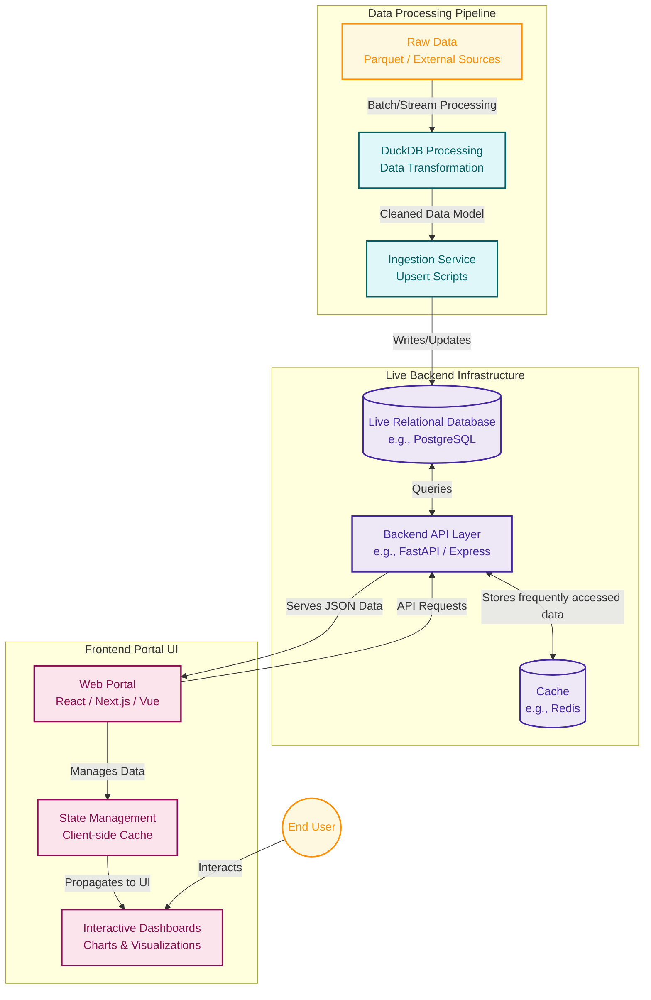

# Portal System Architecture Schema

This document outlines the target system architecture for the portal, shifting from static data generation to a dynamic, live-database-driven application. This diagram and breakdown are intended to help the visual dialogue team (designers, web developers) and the data engineering team align on the necessary system components.

## Architecture Diagram

## Component Breakdown

To support live updates and dynamic visualizations, the final system will require the following distinct components:

### 1. Data Processing Pipeline (Existing -> Adapted)
*   **Current State**: Scripts like `build.py` currently use DuckDB to process raw parquet data and spit out static findings or templates.
*   **Target State**: We will adapt these Python scripts into an **Ingestion Service**. This service will periodically process incoming data and push it (upsert) to our Live Database to ensure the information is always fresh.

### 2. Live Database
*   **Role**: The central source of truth for the portal. Instead of relying on static CSV or JSON files generated locally, the data (like `membership`, `panel` rows, industry sectors, etc.) will live here.
*   **Tech Stack**: PostgreSQL is highly recommended for handling complex relational data, aggregations, and concurrent analytical queries efficiently.

### 3. Backend API Layer
*   **Role**: Acts as the bridge between the Live Database and the Frontend Portal. It secures the database, optimizes queries, and handles caching so the portal loads instantly.
*   **Tech Stack**: Python (FastAPI/Django) or Node.js (Express/NestJS). This layer will expose REST or GraphQL endpoints (e.g., `/api/pathways`, `/api/occupations`) that the web developers will consume.

### 4. Frontend Portal UI (Visual Dialogue Team)
*   **Role**: The user-facing web application that dynamically fetches data. Since the backend now exposes live data, the designers and web devs can build highly interactive dashboards. 
*   **Components**:
    *   **Core Framework**: A modern reactive framework like Next.js, React, or Vue.js.
    *   **Data Fetching**: Libraries like React Query or SWR to manage fetching, caching, and updating the UI when new data arrives.
    *   **Visualizations**: Charting libraries (e.g., D3.js, Chart.js, Recharts) to render the interactive demographic and pathway graphs dynamically based on the current data state.

> [!TIP]
> **Key Frontend Features Required:**
> *   **Dynamic Filtering:** Users should be able to instantly filter visualizations by occupation, industry sector, demographic markers, and career age without reloading the page.
> *   **Interactive Transitions:** Micro-animations for chart updates to help users visually track data changes (e.g., smoothly transitioning Sankey/Pathway lines when filters change).
> *   **Responsive Layout:** A mobile-friendly and tablet-optimized view for sharing findings easily in meetings or on the go.
> *   **Export/Share:** Ability to download specific views as PDFs/Images or share direct URLs reflecting the exact filter state.
> *   **Dark/Light Mode:** Premium aesthetic toggles tailored to the team's sleek design system.
## Why this structure?
By decoupling the data processing from the frontend visualization via an API and Live Database, **the portal UI becomes a standalone web application**. When new data arrives, the pipeline updates the database, and the frontend will automatically reflect those changes on the next reload without requiring developers to push new HTML/JS templates.
