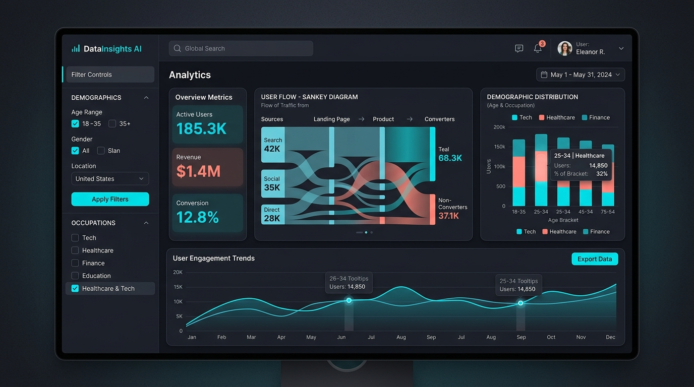

# Portal & Interactive Dashboards UI/UX Specification

This document serves as the foundational design specification for the new interactive portal. It is intended to accompany system architecture diagrams and prototypes to align the visual dialogue team on the look, feel, and functionality of the frontend.

## 1. Aesthetic Guidelines
The portal must convey a highly professional, modern, and data-driven aesthetic. 
*   **Color Palette**: A curated, harmonious palette. Avoid pure black/white or generic primary colors. Use deep charcoal/slate for dark mode backgrounds, with high-contrast accent colors (e.g., vibrant teal, soft coral, or electric blue) for data points.
*   **Typography**: Clean, modern sans-serif fonts (e.g., *Inter*, *Roboto*, or *Outfit*). Prioritize readability, especially for data labels and tooltip information.
*   **Theming**: Full support for both **Dark Mode** (sleek, reducing eye strain for long sessions) and **Light Mode** (clean, high legibility for presentations).
*   **Glassmorphism/Depth**: Use subtle blurring and soft drop shadows on floating elements (like tooltips or sticky headers) to create a sense of depth without cluttering the interface.

## 2. Core Layout & Navigation
The layout should prioritize the data visualizations while keeping controls accessible.
*   **Left/Right Sidebar (Filter Panel)**: A collapsible sidebar housing all global filters (e.g., Occupation, Industry Sector, Career Age, Demographics). Changes here instantly update the main view.
*   **Main Content Area**: The expansive central canvas dedicated entirely to the charts and data visualizations.
*   **Top Navigation Bar**: Contains global controls like the Dark/Light mode toggle, Export/Share buttons (PDF, PNG, URL link), and broad category tabs (e.g., "Demographics", "Career Pathways").

## 3. Interactive Dashboards & Visualizations
The visualizations are the core of the portal. They must be dynamic and highly interactive.
*   **Sankey / Pathway Diagrams**: 
    *   *Purpose*: To show career transitions and pathways between industries/occupations.
    *   *Interactivity*: Hovering over a node should highlight the incoming and outgoing flows while dimming unrelated data. 
*   **Bar / Distribution Charts**: 
    *   *Purpose*: For demographic breakdowns and comparative metrics.
    *   *Interactivity*: Click-to-drill-down capabilities to explore sub-categories.
*   **Data Tooltips**: Fast-rendering, floating tooltips on hover that display exact numbers, percentages, and contextual information.

## 4. Micro-Interactions & Animation
A static dashboard feels dead. Micro-animations make the data feel alive.
*   **Fluid Transitions**: When a user changes a filter in the sidebar, the data points (lines, bars, nodes) should smoothly animate to their new positions/values rather than snapping instantly.
*   **Hover States**: Buttons, chart nodes, and list items should have subtle scale or color transitions on hover to indicate interactivity.
*   **Loading States**: If an API request takes a moment, use skeleton loaders that match the layout shape rather than generic spinning wheels.

## 5. Sharing & Exporting Features
Because this portal will be used in presentations and shared among stakeholders:
*   **Stateful URLs**: Every change in the filter panel must update the URL parameters. Sharing the URL shares the exact view the user is looking at.
*   **Quick Export**: A one-click button to export the current dashboard view as a high-quality PDF or PNG image formatted nicely for slide decks.

## 6. Visual Mockup

